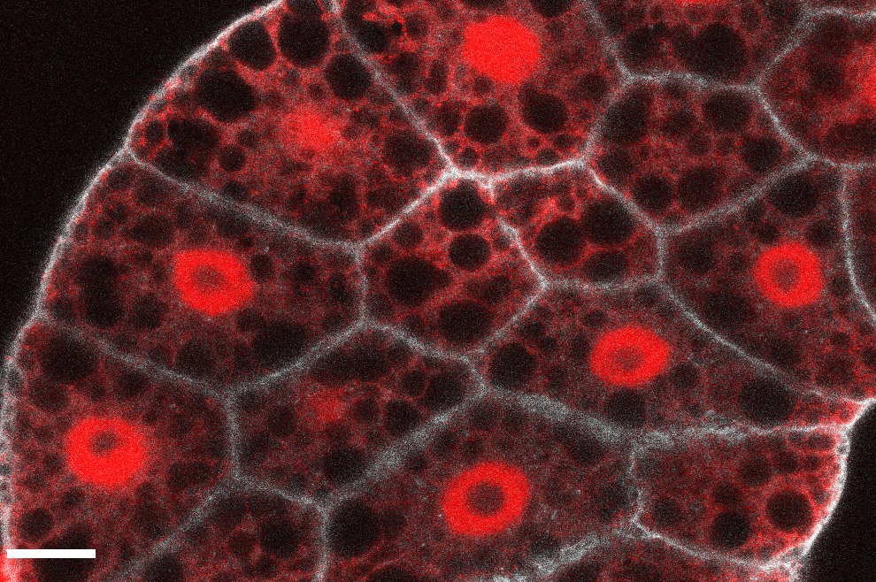

## Introduction to cell biology
11/10/2021

[Ana Pengelly, PhD](http://anapengelly.info/)

---

####  The Cell

Eukaryotic cells within a fatty tissue in *Drosophila melanogaster*.

[//]: # ()

---

### Prokaryotic cells
* Simpler organisms
* Mostly live as independent individuals or communities (they are mostly unicellular)
* Don't store their DNA in a distinct membrane-enclosed nucleus
* Examples are bacteria (such as *Streptococcus pneumoniae*)  and archea 

---

### Eukaryotic cells
* in general are bigger and more elaborate than prokaryotic cells
* generally form multicellular organisms
* complex cellular structure (e.g. store their DNA in a distinct membrane enclosed nucleus)
* contain many organelles (like mithochondria, chloroplasts in plants)

---

### Cells Store Their Hereditary information in the same linear Chemical Code: DNA
 

> Some stuff

---

###  Thanks very much! 

:smile:

---
